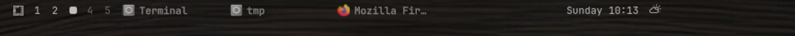

# Omarchy Taskbar

A real taskbar for the [Omarchy](https://omarchy.org/) bar (Hyprland + Quickshell). Lists open windows, filtered to whichever monitor the bar instance is on, with app icons, click-to-focus, minimize, and a hover preview.



## Why

Hyprland is a tiling compositor with no native minimize and no built-in taskbar/dock. This plugin adds one directly into the Omarchy bar rather than running a separate dock process.

## Features

- **Per-monitor window list** — each bar instance shows only the windows on its own monitor, not every window on the system.
- **Click to focus, click again to minimize** — clicking an unfocused entry focuses it; clicking the already-focused entry "minimizes" it. Hyprland has no native minimize, so this works by parking the window on a dedicated hidden special workspace and restoring it to your current workspace on click.
- **Middle/right-click to close.**
- **App icons**, resolved from the window's class via the system icon theme, with a generic fallback for apps that don't match one (PWAs, some Electron apps).
- **Auto-fit width** — the row never overlaps the bar's center section (clock, etc.); it shrinks entries to fit, and once there's no room left for readable labels it collapses to a compact icon-only strip instead of unreadable slivers of text.
- **Hover preview** — hovering an entry captures and shows that window's actual current content (via `grim`), refreshed periodically while hovered, alongside the window title.
- Works on horizontal and vertical bars.

## Requirements

- Omarchy / Hyprland with the Lua dispatcher API (`hl.dsp.*` — ships with recent Hyprland).
- [`grim`](https://sr.ht/~emersion/grim/) for hover previews (already installed on most Omarchy systems; previews are skipped gracefully if it's missing).

## Install

```bash
omarchy plugin add https://github.com/p145085/omarchy-taskbar.git --enable --yes
omarchy bar move emila.taskbar --section left
```

Or by hand:

```bash
git clone https://github.com/p145085/omarchy-taskbar.git ~/.config/omarchy/plugins/emila.taskbar
omarchy-shell shell rescanPlugins
omarchy plugin enable emila.taskbar left
```

## Configuration

Set these on the widget's entry in `~/.config/omarchy/shell.json` (`bar.layout.<section>`):

```json
{ "id": "emila.taskbar", "maxItemWidth": 170, "centerMargin": 200 }
```

| Key | Default | Meaning |
|---|---|---|
| `maxItemWidth` | `170` | Widest an entry is allowed to grow, in px. |
| `centerMargin` | `200` | Reserved space (px) before the bar's center section, since the bar does no space-negotiation between widgets on its own. Increase this if your center section (clock + other widgets) is wider than the Omarchy default and entries still overlap it. |

## Known limitations

- Hover preview is a fresh screenshot on a timer (~1.2s), not a continuous video feed — expect a little lag versus the real window.
- Minimize/restore is address-based Hyprland IPC, not a real compositor-level minimize (Hyprland doesn't have one).
- `centerMargin` is a fixed guess at the center section's width, not measured live — there's no bar API for widgets to negotiate space with each other.

## License

MIT — see [LICENSE](LICENSE).
